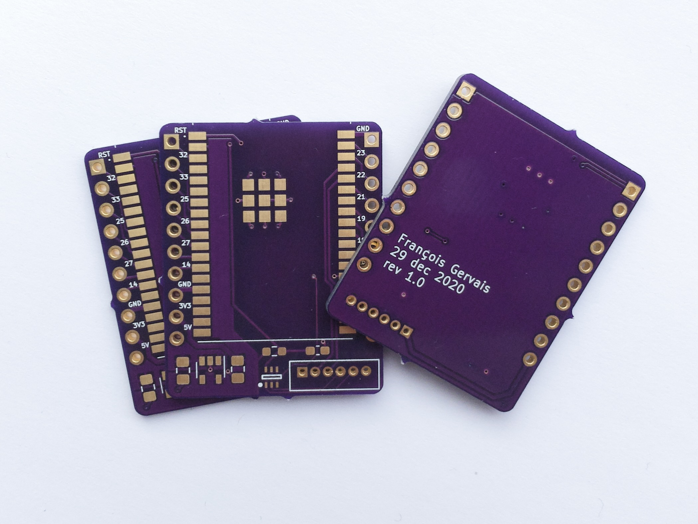
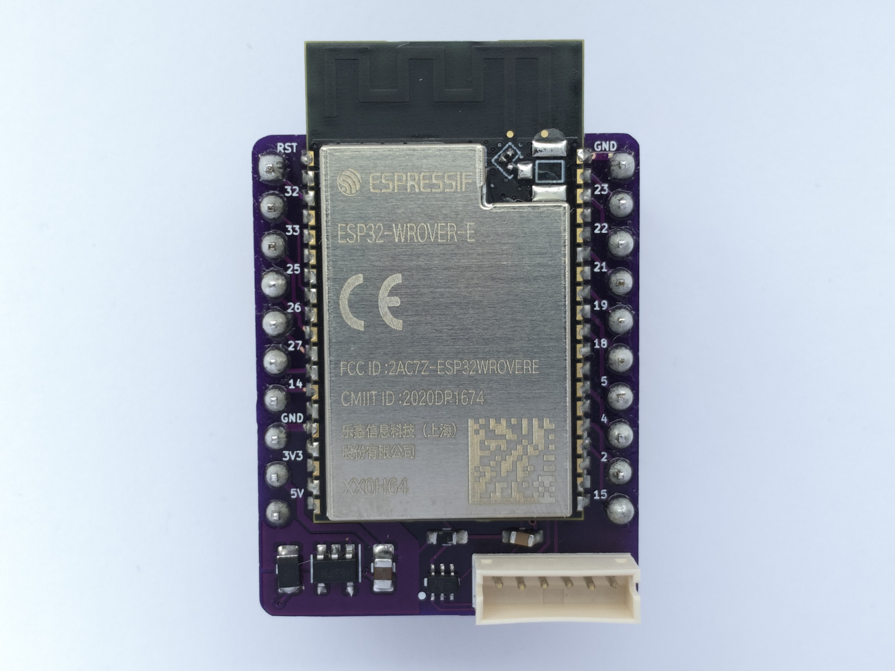

# Objective

The goal of this project is to make a lower cost esp32 module than the TinyPICO
for my other projects.

The TinyPICO is great. It is small and uses low current in deep sleep but it
costs me about 40$ CAD once it reaches me. I'd prefer if I could have something
at around 10$ CAD which is the goal of this project.

# Breadboard version

