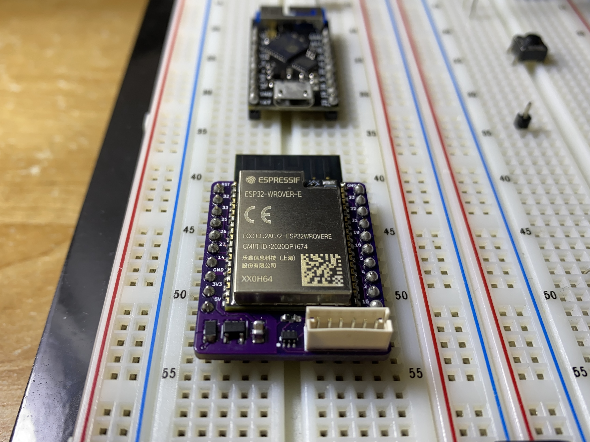
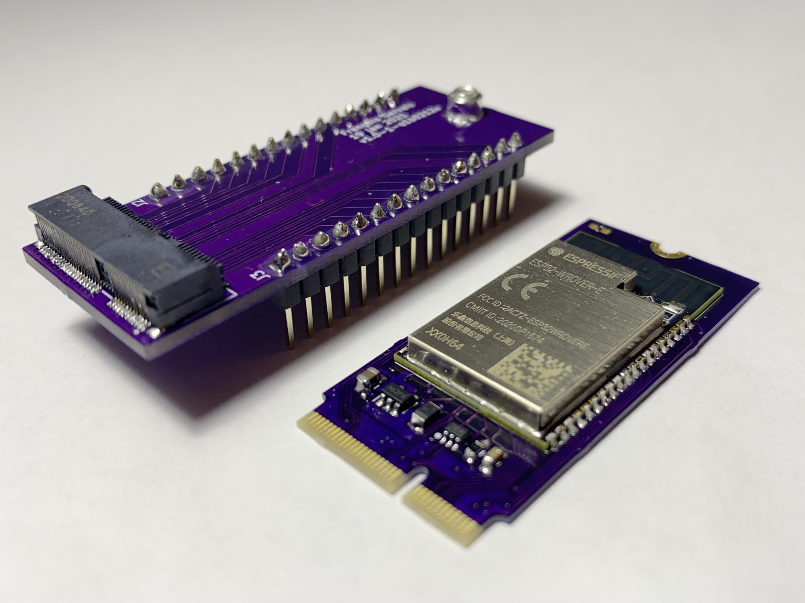

# Objective

The goal of this project is to make a lower cost esp32 module than the TinyPICO
for my other projects.

The TinyPICO is great. It is small and uses low current in deep sleep but it
costs me about 40$ CAD once it reaches me. I'd prefer if I could have something
at around 10$ CAD which is the goal of this project.

# Breadboard Version

## Price

The bare PCB costs 2.67$ CAD from OSH Park.
Digikey BOM cost for 1 unit is 8.09$ CAD.

Total is 10.76$ CAD (worst case)

## PCB

[OSH Park](https://oshpark.com/shared_projects/hciJOsgc)

## BOM

[Digikey BOM](https://www.digikey.ca/BOM/Create/CreateSharedBom?bomId=8507784)

## Programming

The programming is done through the JST connector using the 
[Adafruit 3309](https://www.adafruit.com/product/3309) along
with the following adapter:

[Github](https://github.com/fgervais/project-adafruit-3309-adapter/tree/master/hardware/jst-zh)
[OSH Park](https://oshpark.com/shared_projects/B9to99oI)

### Firmware

The GENERIC-SPIRAM firmware can be downloaded from the following page:

https://micropython.org/download/esp32/

The module has been validated to work with:

esp32spiram-idf4-20210202-v1.14.bin

# M.2 Version

## Price

Bare PCB (OSH Park): 3.47$ CAD
BOM (Digikey, 1 unit): 7.84$ CAD

Total: 11.31$ CAD (worst case)

## BOM

[Digikey BOM](https://www.digikey.ca/BOM/Create/CreateSharedBom?bomId=8549197)
